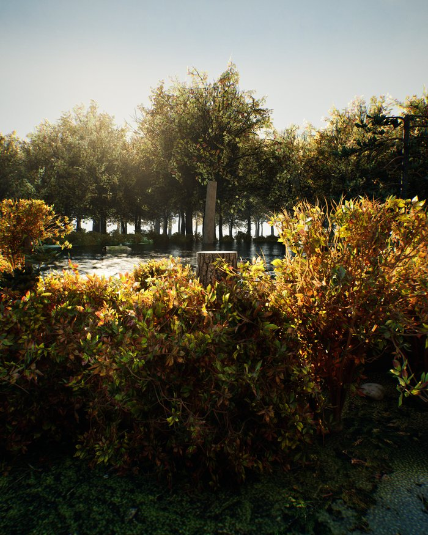
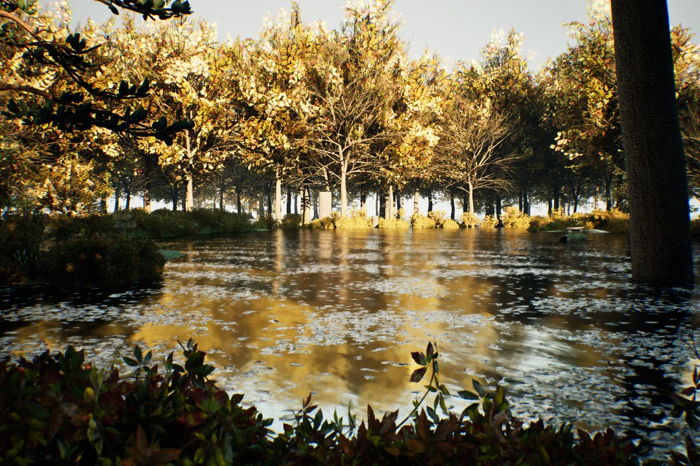
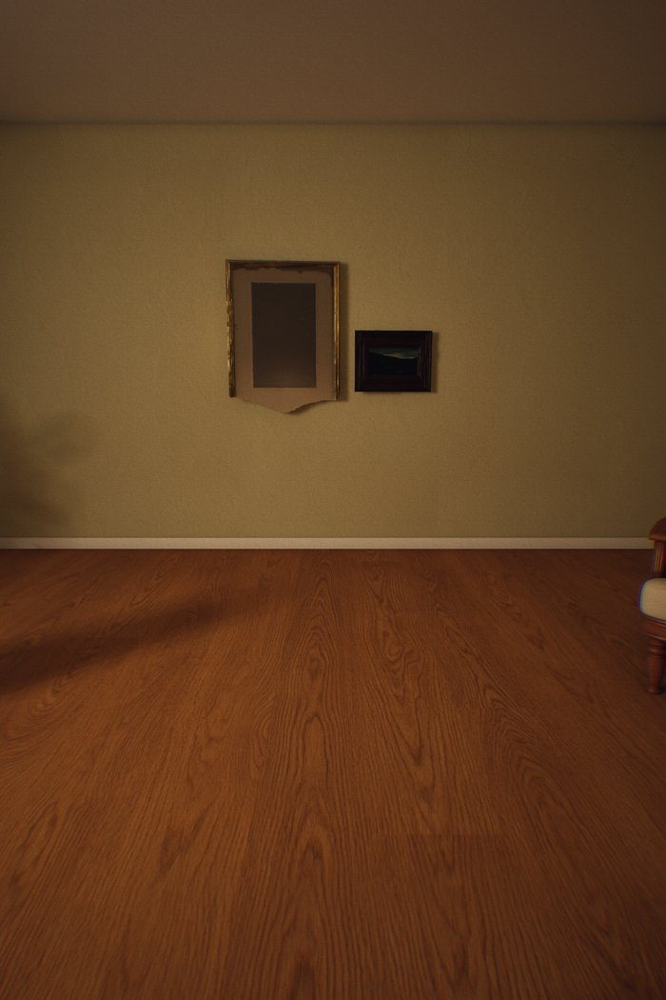
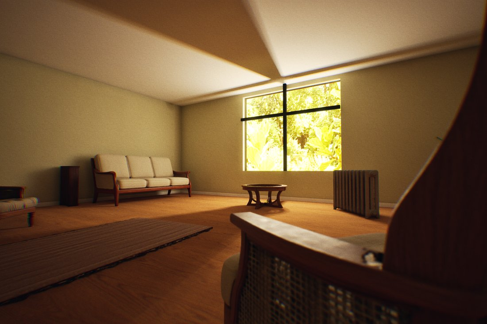
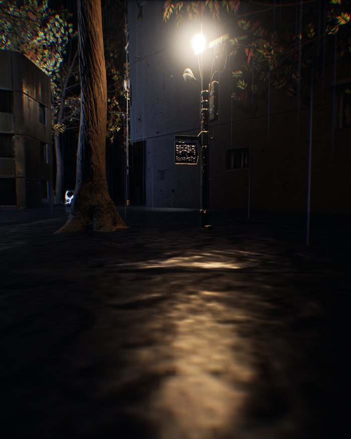
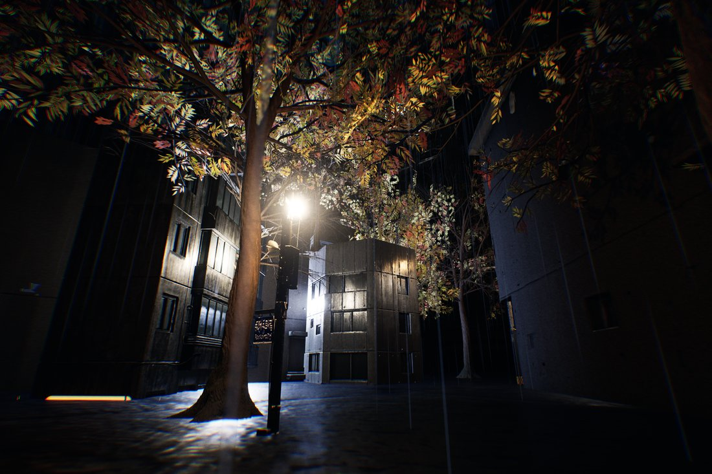
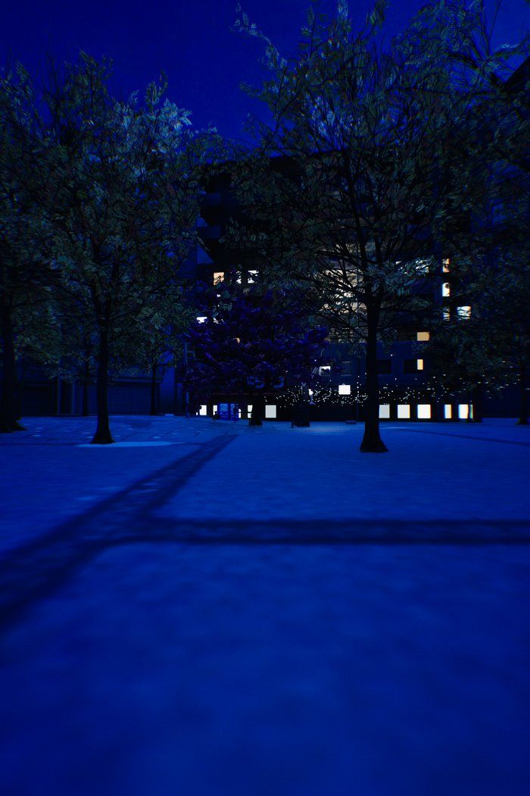
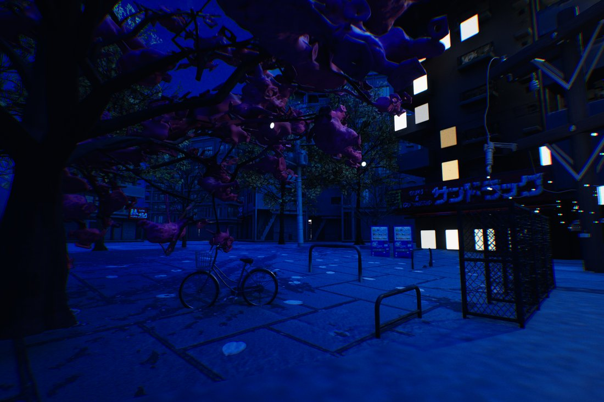

# Photo → Walkable UE5 Scene

*MA Design Informatics dissertation project · The University of Edinburgh · 2026*

Given **one input photo**, the system automatically reconstructs it into a game scene that can be freely explored in Unreal Engine 5.7.

## The four case scenes

| Case | Reconstruction (photo-camera view) | In-game view |
|---|---|---|
| **Forest lake** |  |  |
| **Indoor living room** |  |  |
| **Rain alley** |  |  |
| **Street at night** |  |  |

Core principles: **deterministic, theory-driven, fully generic (no per-scene special cases), AI-decided content (Gemini determines what the scene contains), code/API-driven (no manual edits in UE), portable across projects, and trust nothing until it has been verified**.

## Pipeline (one photo → one scene)

`Photo → Gemini perception (space/environment/lighting/objects) → Gemini object image generation → Tripo3D image-to-3D → Depth-Anything terrain inference → projection layout → props/FX → UE assembly (sky/terrain/lighting/atmosphere/objects) → walkable game scene`

- **Gemini**: all 2D understanding and image generation (object images, HDRI panoramas, terrain textures, prop/FX textures).
- **Tripo3D**: image → 3D mesh only (main subject at detailed+HD, everything else on Turbo).
- **Depth-Anything V2**: CPU depth back-projection into a top-down height grid → real terrain relief.

## Repository structure

```
photo-to-ue5-scene/
├── pipeline_server.py    Flask backend + the full Gemini/Tripo/terrain pipeline (port 5001)
├── ue_scene_builder.py   UE-side scene builder (exec inside UE / invoked via the bridge)
├── ue_remote_bridge.py   Native UE Python remote-execution bridge (drives UE + reads back renders)
├── ue_task_watcher.py    UE-side polling/placement (fallback channel)
├── ue_scene_reveal.py    Layer-2 reveal mechanism for the demo (seduce-then-reveal + photo compare)
├── ue_deploy_library.py  Copies the material library into any UE project's Content/ (assets mount under /Game/Tool/)
├── ue_fx_presets.py      Niagara live-particle presets (source of truth for the inline adapters)
├── ue_water_presets.py   MA_YX_Blend water-body material presets
├── templates/            Web UI (index.html: upload; canvas.html: 3D layout view)
└── docs/                 Setup notes referenced by the code (material library / Niagara / indoor shell / water / rain / light params / alpha masks)
```

Not included in this code release: the bundled UE material library `ue_library/` (~290 MB of binary UE assets), runtime artifacts (`output/`, `uploads/`, `hdri_cache/`), sample photos, and development/diagnostic scripts.

> **Do not move the runtime files**: `pipeline_server.py` locates `output/` and `uploads/` via `os.path.dirname(__file__)`, and Flask looks for `templates/` next to it by default.

## Setup

1. Install dependencies:
   ```
   pip install -r requirements.txt
   ```
2. Provide API keys (never hardcoded in this repo). Either set the environment variables `GEMINI_API_KEY` and `TRIPO3D_API_KEY`, or copy `apikeys.local.json.example` to `apikeys.local.json` and fill in your keys (that file is gitignored).

## Running

```powershell
# Backend (Windows; force UTF-8 because of non-ASCII paths)
$env:PYTHONUTF8=1; $env:PYTHONIOENCODING="utf-8"; python pipeline_server.py     # → http://127.0.0.1:5001
```
- Upload a photo through the web page → once the run completes, `/latest` serves the newest result.
- UE side: inside UE5.7 run `exec(open(r"...\ue_scene_builder.py", encoding="utf-8").read())`, or drive/render through the bridge with `python ue_remote_bridge.py <script.py>`.

## Toggles (top of pipeline_server.py)

`ENABLE_HDRI / ENABLE_TERRAIN / ENABLE_FX`; `FAST_MODE=True` downgrades everything with one switch to save cost (the main subject also runs on Turbo, etc.).

## Contact

Questions about this project: **yizhouwang0629@gmail.com**

